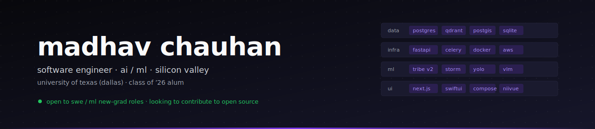
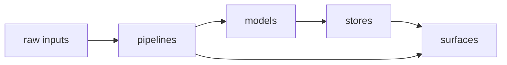

  

  <a href="https://linkedin.com/in/madhav-s-c">linkedin</a> &middot;
  <a href="mailto:madhavcbusiness@gmail.com">email</a> &middot;
  <a href="https://madhavchauhan.tech">portfolio</a>

---

### now

AI Software Engineer at a stealth company in Silicon Valley.

Building:
- **[Agentary](https://github.com/madhavcodez/agentary)** &mdash; autonomous multi-agent research platform
- **[Cortexia](https://github.com/madhavcodez/cortexia)** &mdash; fMRI-validated brain-encoding for video

### previously

- **[Basketball Intelligence](https://github.com/madhavcodez/basketballintelligence)** &mdash; NBA analytics &plus; film breakdown
- **UT Disaster** &mdash; professor-led geospatial research on Hurricane Florence imagery
- **SentinelEdge** &mdash; edge-AI video security on Jetson Nano
- **[rajputra.org](https://rajputra.org)** &mdash; community engagement portal

---

---

| | |
|---|---|
| **languages** | python &middot; typescript &middot; c/c++ &middot; java &middot; kotlin &middot; swift &middot; go &middot; sql |
| **ml / edge** | pytorch &middot; tensorflow &middot; tf lite &middot; yolo &middot; vlm &middot; jetson &middot; mqtt |
| **infra** | postgres &middot; redis &middot; qdrant &middot; postgis &middot; aws &middot; docker &middot; k8s &middot; airflow |
| **frameworks** | fastapi &middot; spring boot &middot; next.js &middot; react &middot; angular &middot; swiftui &middot; jetpack compose |

---

  shipping from dallas &middot; university of texas (dallas) alum, class of &rsquo;26 &middot; open to swe / ml roles

